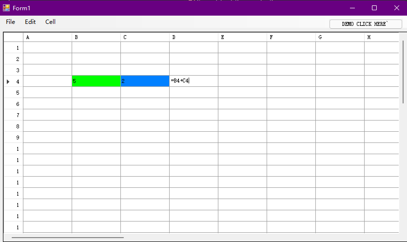

# SpreadSheet Application (C# OOP)

This application simulates the primary functionalities of Microsoft Excel including `Formula Support`, `Load XML`, `Save to XML`, `Redo & Undo Operations`,  and `Background Color Change`.

**Requirement**

`C# (.Net Winform)`

**Run**

`Build and run through VS` or other IDEs

**DEMO**

